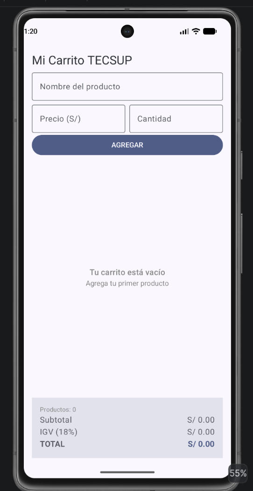
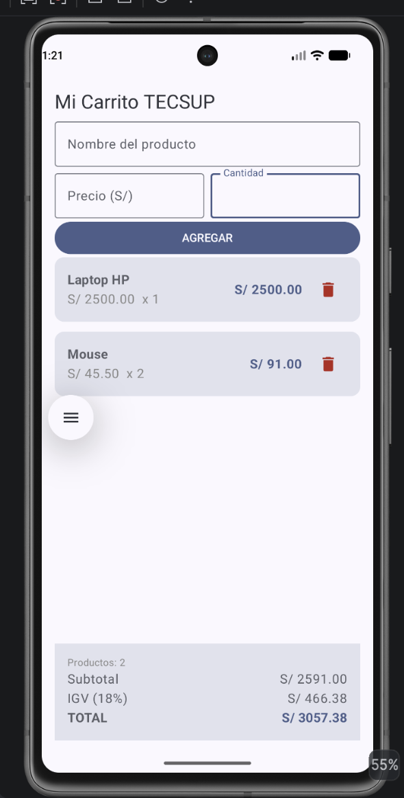
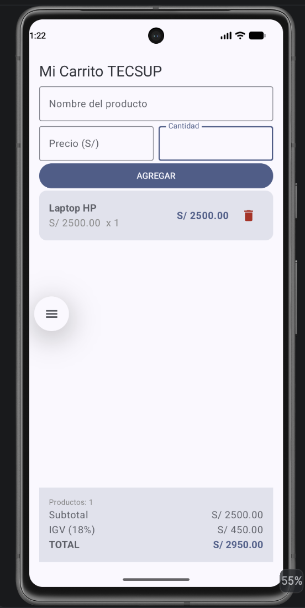

# Mi Carrito TECSUP

**Lucas Inga Marín**

Proyecto semanal del Laboratorio 04: app de carrito de compras construida con Jetpack Compose. Integra un modelo de datos (`Producto`), un formulario para agregar productos y una lista dinámica con `LazyColumn` que permite eliminar productos y recalcula los totales (subtotal, IGV 18% y total) en tiempo real. Cuando el carrito está vacío, se muestra un mensaje centrado en lugar de la lista.

## Capturas

## Respuestas conceptuales

**a) ¿Por qué `mutableStateListOf` y no una `MutableList` normal?**

`mutableStateListOf` crea una lista observable dentro del sistema de estado de Compose: cuando se agrega o elimina un elemento, Compose detecta el cambio y recompone (redibuja) automáticamente la UI que depende de esa lista. Una `MutableList` normal (`mutableListOf`) no está conectada a ese sistema de snapshots, así que aunque su contenido cambie internamente, la pantalla nunca se entera y no se actualiza sola.

**b) ¿Por qué la lista se declara con `val`?**

`val` solo impide reasignar la variable (no se puede hacer `productos = otraLista`), pero no impide modificar el objeto al que esa variable apunta. `mutableStateListOf()` devuelve una lista mutable (`SnapshotStateList`) cuyo contenido sí se puede cambiar con `.add()` o `.remove()` sin necesidad de reasignar la referencia — por eso `val` es suficiente y de hecho lo correcto aquí.

**c) ¿Qué hace `weight(1f)` en la `LazyColumn`?**

Hace que la `LazyColumn` ocupe todo el espacio vertical que sobra dentro de la `Column` principal, después de que el formulario y el panel de totales toman el espacio que necesitan. Así la lista es la parte que se estira o encoge según la pantalla, mientras el panel de totales queda con tamaño fijo y siempre visible abajo.