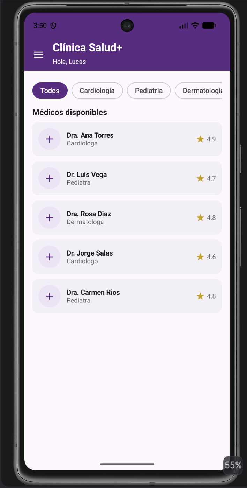
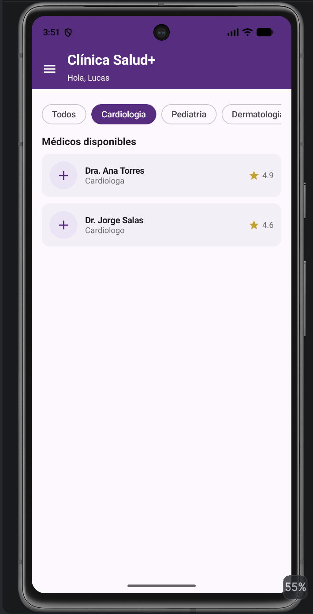
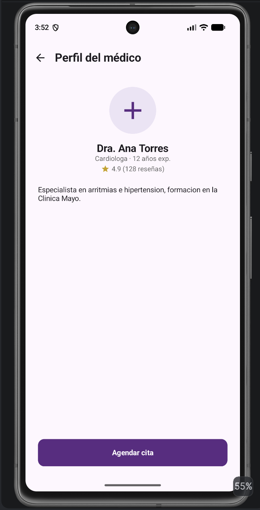
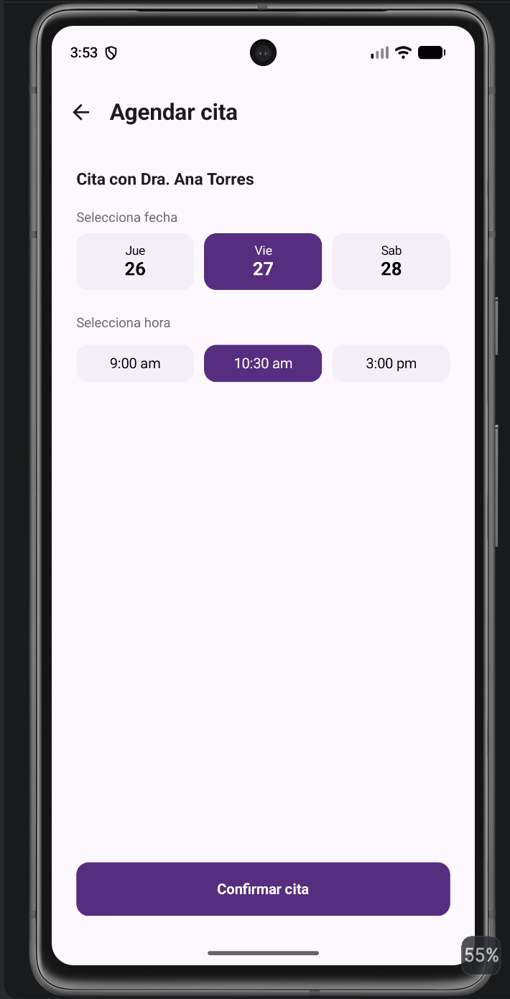
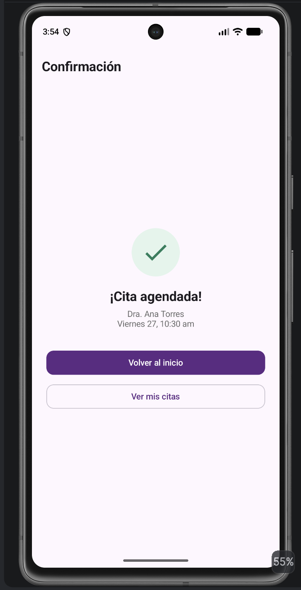
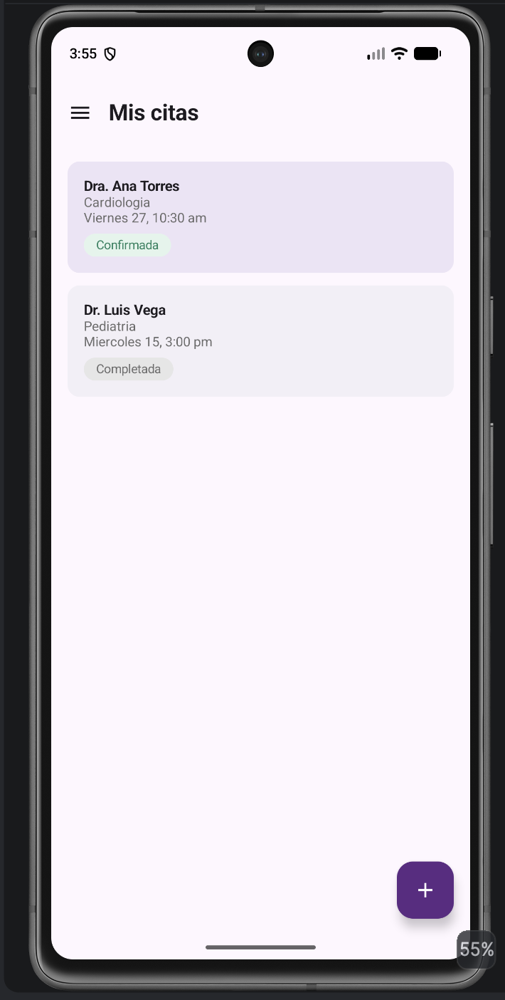
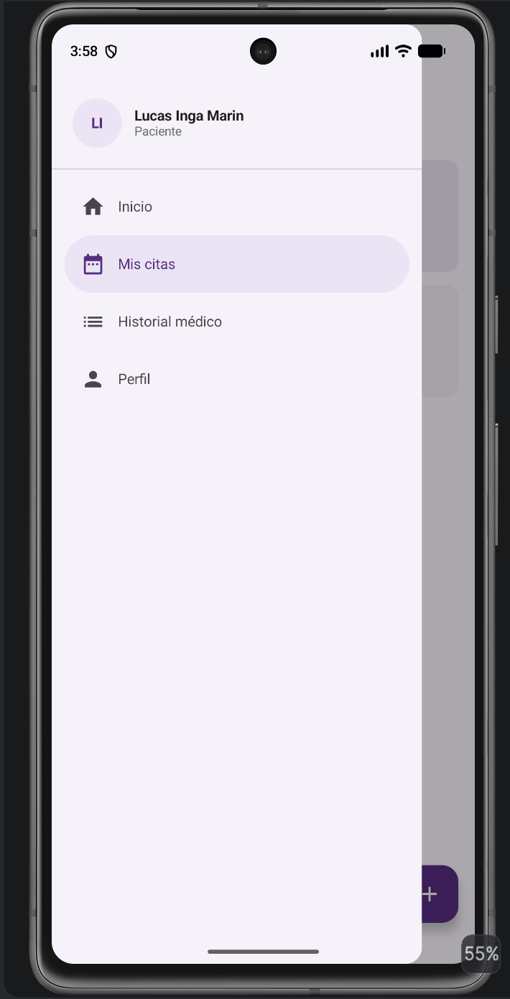
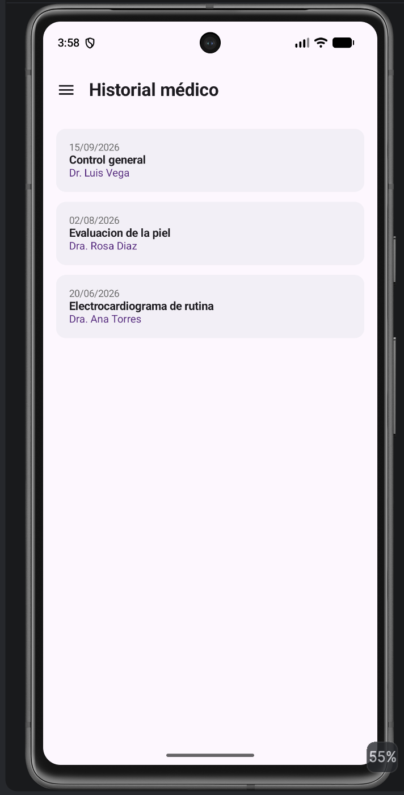
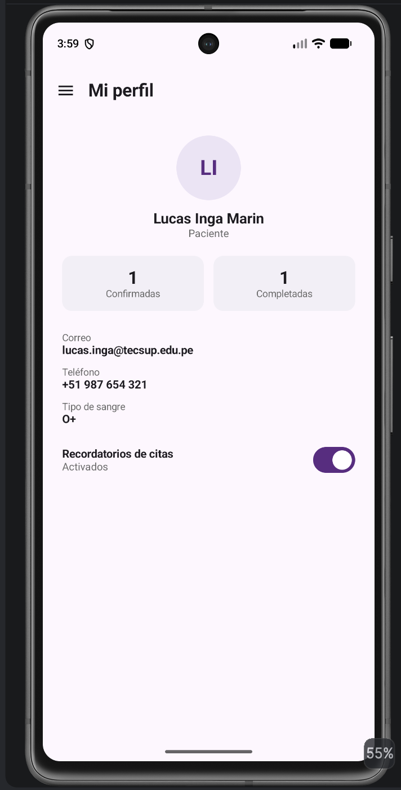

# Clínica Salud+ – Opción A

**Lucas Inga Marín** · Programación en Móviles · Tarea integradora Semanas 1 a 6

App Android en Jetpack Compose para reservar citas médicas. Integra layouts y controles, listas con `LazyColumn` y `LazyRow`, navegación secuencial con paso de parámetros y navegación secundaria con un menú lateral (`ModalNavigationDrawer`). No usa ViewModel ni MVVM: todo el estado se maneja con `remember` y `mutableStateOf`.

## Ramas

| Rama | Contenido |
|---|---|
| `main` | Fase 1: app completa según el enunciado |
| `mejora-ia-clinica` | Fase 2: mejora funcional con IA + `PROMPTS.md` |

## Requerimientos funcionales

| Código | Requerimiento |
|---|---|
| RF-01 | El Inicio muestra una fila de chips de especialidad (`LazyRow`) y una lista de médicos (`LazyColumn`), con nombre, especialidad y calificación en cada tarjeta. |
| RF-02 | Al elegir un chip, la lista se filtra por especialidad; el chip "Todos" muestra a todos los médicos. |
| RF-03 | El perfil del médico recibe el id del médico elegido por parámetro de navegación y muestra sus datos, con el botón "Agendar cita". |
| RF-04 | Al agendar, el usuario elige una fecha y una hora (3 opciones cada una, selección única). El botón "Confirmar cita" solo se activa cuando ambas están elegidas. |
| RF-05 | La confirmación muestra el resumen de la cita (médico, fecha y hora), con botones para volver al inicio y ver mis citas. |
| RF-06 | El menú lateral se abre con el ícono ☰ y lleva a Inicio, Mis citas, Historial médico y Perfil, resaltando la sección actual. |
| RF-07 | Mis citas lista las citas agendadas con su estado (Confirmada / Completada) diferenciado por color. La cita recién agendada aparece al inicio de la lista. |
| RF-08 | Desde Mis citas, un botón flotante (FAB) permite ir a agendar una nueva cita. |
| RF-09 | El perfil muestra los datos del paciente, el número de citas confirmadas y completadas, y un Switch para activar o desactivar los recordatorios. |

## Flujo de navegación

```
Inicio ──(medicoId)──► Perfil del médico ──(medicoId)──► Agendar cita ──(medicoId, fechaIndex, horaIndex)──► Confirmación

Menú lateral (☰): Inicio · Mis citas · Historial médico · Perfil
```

## Estructura del proyecto

```
com.lucasinga.semana05_clinicasalud
├── model        → Modelos.kt (data class) y Datos.kt (datos de ejemplo)
├── navigation   → Screen.kt (rutas) y AppNavigation.kt (drawer + NavHost)
├── screens      → Inicio, PerfilMedico, AgendarCita, Confirmacion, MisCitas, Historial, Perfil
├── ui.theme     → colores de la clínica
└── MainActivity.kt → solo llama a AppNavigation()
```

## Conceptos aplicados

- **Scaffold** en todas las pantallas: `topBar`, `content { padding -> }` y `floatingActionButton` en Mis citas.
- **ModalNavigationDrawer** envolviendo el contenido, porque el menú debe cubrir toda la pantalla, incluida la `topBar`.
- **NavHost / composable / navArgument** con argumentos `Int` para pasar el médico, la fecha y la hora.
- **popUpTo** al confirmar, para que "atrás" no regrese a la pantalla de agendar.
- **Listas anidadas:** la `LazyRow` de chips va dentro de la `LazyColumn` de médicos.
- **Selección única** de fecha y hora, que funciona como un RadioButton: se guarda una sola posición por grupo.
- **Switch** para los recordatorios.

## Capturas

<p>
  
  
  
</p>
<p>
  
  
  
</p>
<p>
  
  
  
</p>