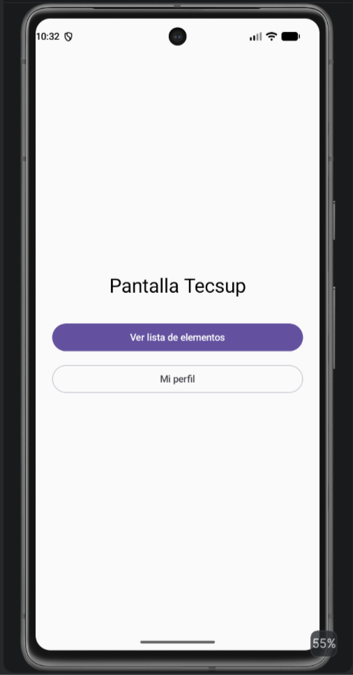
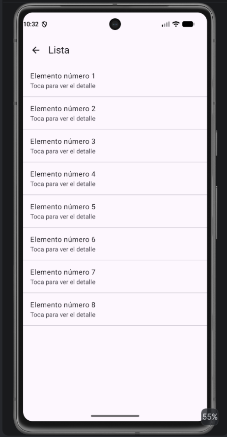
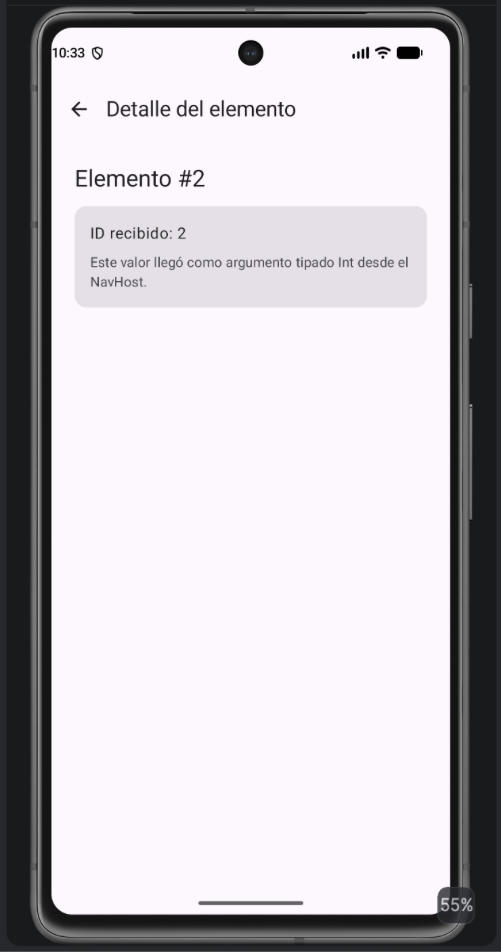
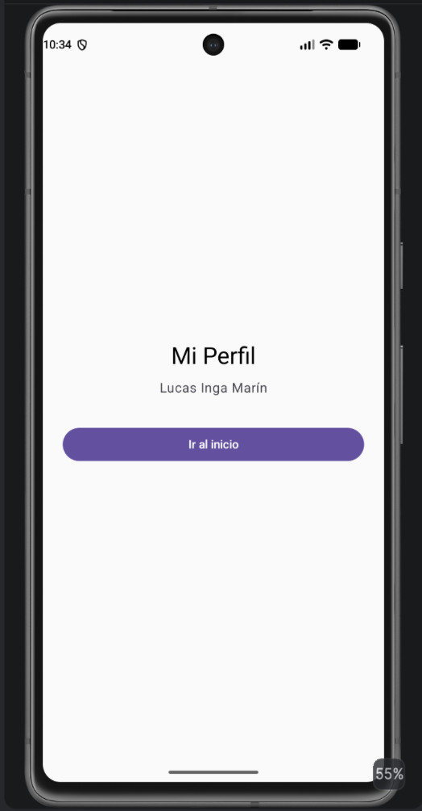
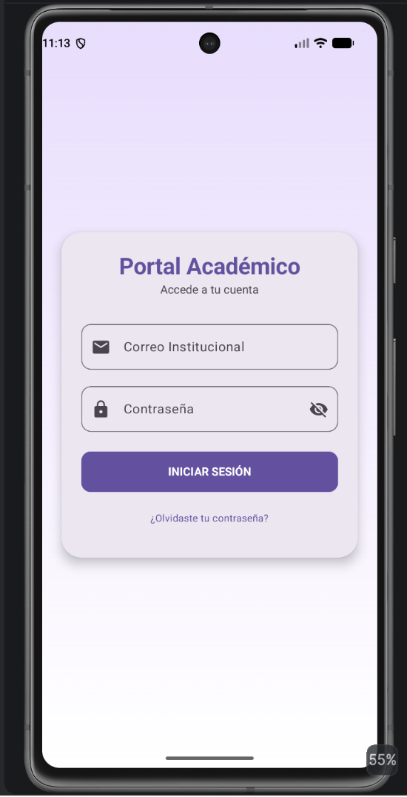
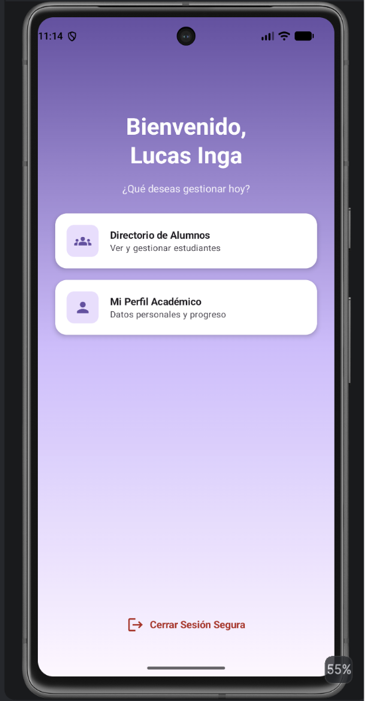
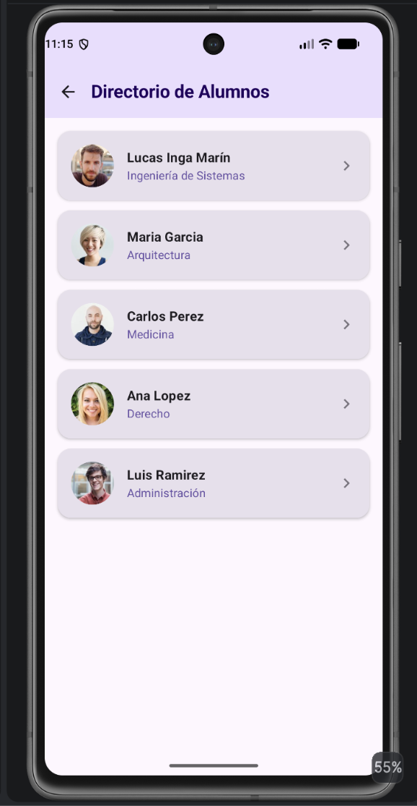
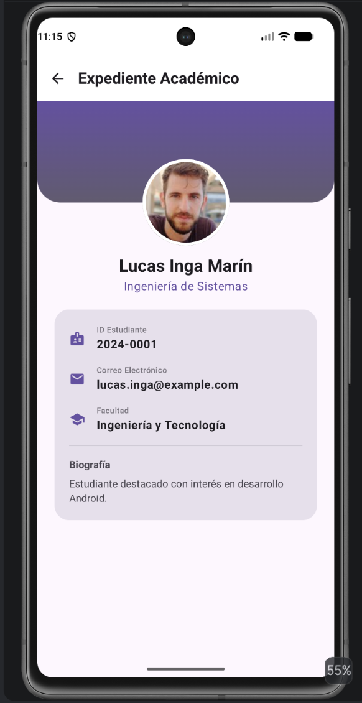
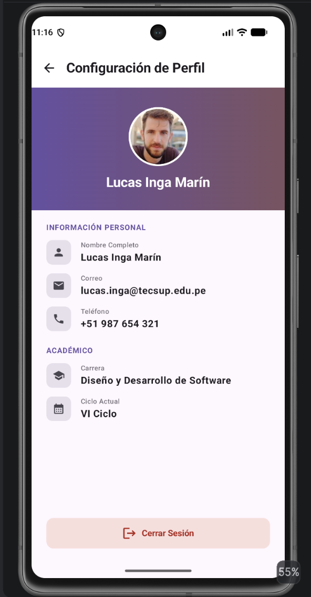
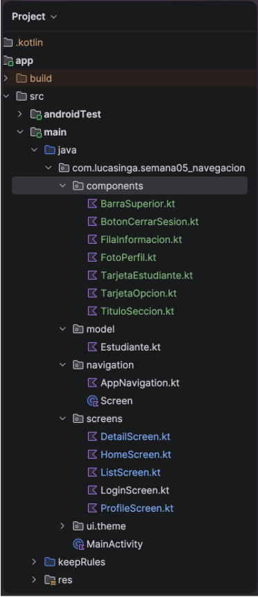

# Laboratorio 05 – Navegación en Jetpack Compose

**Lucas Inga Marín**

App Android con Jetpack Compose que implementa navegación entre pantallas usando `navigation-compose`. Las rutas se definen en una `sealed class Screen` y el `NavHost` vive en `AppNavigation`, que es llamado desde `MainActivity`. Incluye una ruta con argumento tipado (`detail/{itemId}` con `NavType.IntType`), regreso con `popBackStack()` y limpieza del back stack con `popUpTo(...) { inclusive = true }`.

Luego se mejoró el diseño con el agente de **Gemini en Android Studio** y se separaron los componentes reutilizables en archivos independientes.

## Estructura

```
com.lucasinga.semana05_navegacion
├── components   → componentes reutilizables (generado con Gemini)
├── model        → data class Estudiante y datos de ejemplo
├── navigation   → Screen.kt (rutas) y AppNavigation.kt (NavHost)
├── screens      → Login, Home, List, Detail y Profile
├── ui.theme
└── MainActivity.kt
```

## Parte 1: Navegación base

Flujos: Home → Lista → Detalle (con `itemId`) y Home → Perfil → Inicio (limpiando el back stack).

<p>
  
  
  
  
</p>

## Parte 2: Mejora del diseño con Gemini

**Herramienta:** agente de Gemini en Android Studio (modo Agent)  
**Modelo:** Gemini 3.6 Flash

### Prompt 1: rediseño de la interfaz

```text
Actúa como desarrollador Android experto en Jetpack Compose y Material 3. Vas a rediseñar la interfaz de este proyecto (app de navegación del Laboratorio 05) para que se vea exactamente como se describe abajo. Sigue TODAS las especificaciones al pie de la letra; no inventes estilos, textos ni colores distintos.

## 1. CONTEXTO DEL PROYECTO ACTUAL
- Proyecto Jetpack Compose con navigation-compose 2.7.7.
- Paquete "navigation": Screen.kt (sealed class con rutas home, list, profile, detail/{itemId} y createRoute) y AppNavigation.kt (NavHost).
- Paquete "screens": HomeScreen.kt, ListScreen.kt, DetailScreen.kt, ProfileScreen.kt. Cada pantalla recibe navController: NavController; DetailScreen además recibe itemId: Int.
- MainActivity solo llama a AppNavigation() dentro de setContent.

## 2. REGLAS OBLIGATORIAS
- Respeta el nombre de paquete que ya existe en el proyecto.
- NO modifiques MainActivity.kt. No agregues ni envuelvas nada en un Theme.
- Mantén la arquitectura: sealed class Screen + AppNavigation con NavHost + un archivo por pantalla en "screens". No cambies los nombres de las funciones existentes.
- Sin ViewModel, sin Hilt, sin base de datos, sin llamadas a API. Datos locales de ejemplo.
- Usa colores con valores hexadecimales fijos (Color(0xFF......)) tal como se indican, no colores dinámicos.
- Todos los textos en español, exactamente como están escritos aquí.
- Código sin comentarios innecesarios.

## 3. DEPENDENCIAS Y PERMISOS
En build.gradle.kts (Module :app) agrega exactamente estas dos líneas (no cambies ninguna otra dependencia ni versión):
implementation("io.coil-kt:coil-compose:2.7.0")
implementation("androidx.compose.material:material-icons-extended")
En AndroidManifest.xml agrega: <uses-permission android:name="android.permission.INTERNET" />
Las fotos se cargan con AsyncImage de Coil 2 (coil.compose.AsyncImage), contentScale = ContentScale.Crop, recortadas en CircleShape y con fondo Color(0xFFE7E0EC) mientras cargan.

## 4. NAVEGACIÓN
- En Screen.kt agrega: object Login : Screen("login").
- En AppNavigation: startDestination = Screen.Login.route y agrega composable(Screen.Login.route) { LoginScreen(navController) }. Las demás rutas se mantienen igual.
- Crea screens/LoginScreen.kt.
- Flujos:
  - Login → botón "INICIAR SESIÓN" → navigate(Screen.Home.route) { popUpTo(Screen.Login.route) { inclusive = true } }. Sin validación de campos.
  - Home → tarjeta "Directorio de Alumnos" → Screen.List.route.
  - Home → tarjeta "Mi Perfil Académico" → Screen.Profile.route.
  - Home → "Cerrar Sesión Segura" y Profile → "Cerrar Sesión" → navigate(Screen.Login.route) { popUpTo(navController.graph.id) { inclusive = true } }.
  - List → tocar un alumno → navigate(Screen.Detail.createRoute(alumno.id)).
  - List, Detail y Profile tienen flecha atrás (Icons.AutoMirrored.Filled.ArrowBack) que hace popBackStack().

## 5. DATOS DE EJEMPLO
Crea en un paquete "model" el archivo Estudiante.kt con:
data class Estudiante(val id: Int, val nombre: String, val carrera: String, val codigo: String, val correo: String, val facultad: String, val biografia: String, val fotoUrl: String)
y una lista val estudiantes = listOf(...) con exactamente estos 5 registros en este orden:
1 | Lucas Inga Marín | Ingeniería de Sistemas | 2024-0001 | lucas.inga@example.com | Ingeniería y Tecnología | Estudiante destacado con interés en desarrollo Android. | https://randomuser.me/api/portraits/men/32.jpg
2 | Maria Garcia | Arquitectura | 2024-0002 | maria.garcia@example.com | Arquitectura y Urbanismo | Apasionada por el diseño sostenible y los espacios urbanos. | https://randomuser.me/api/portraits/women/44.jpg
3 | Carlos Perez | Medicina | 2024-0003 | carlos.perez@example.com | Ciencias de la Salud | Interesado en la investigación clínica y la salud pública. | https://randomuser.me/api/portraits/men/75.jpg
4 | Ana Lopez | Derecho | 2024-0004 | ana.lopez@example.com | Derecho y Ciencias Políticas | Enfocada en derecho corporativo y resolución de conflictos. | https://randomuser.me/api/portraits/women/68.jpg
5 | Luis Ramirez | Administración | 2024-0005 | luis.ramirez@example.com | Ciencias Empresariales | Orientado a la gestión de proyectos y el emprendimiento. | https://randomuser.me/api/portraits/men/51.jpg

## 6. PALETA DE COLORES (usar exactamente)
Morado principal 0xFF6750A4 · Lavanda claro 0xFFEADDFF · Morado oscuro texto 0xFF21005D · Gris tarjeta 0xFFE7E0EC · Fondo tarjeta login 0xFFECE6F0 · Texto secundario 0xFF49454F · Etiquetas grises 0xFF79747E · Rojo 0xFFB3261E · Fondo rojo claro 0xFFF9DEDC · Vino (degradado) 0xFF7D5260 · Casi blanco 0xFFFEF7FF · Blanco 0xFFFFFFFF

## 7. PANTALLAS

### 7.1 LoginScreen ("Portal Académico")
- Fondo: Box fillMaxSize con Brush.verticalGradient(0xFFEADDFF → 0xFFFFFFFF).
- Centrado vertical y horizontal, padding horizontal 24.dp: una Card de ancho completo, esquinas 24.dp, color 0xFFECE6F0, elevación 8.dp, padding interno 24.dp, contenido centrado:
  - "Portal Académico": headlineMedium, negrita, color 0xFF6750A4.
  - "Accede a tu cuenta": bodyMedium, color 0xFF49454F.
  - Spacer 24.dp.
  - OutlinedTextField ancho completo, label "Correo Institucional", leadingIcon Icons.Filled.Email, esquinas 12.dp, una línea.
  - Spacer 12.dp.
  - OutlinedTextField ancho completo, label "Contraseña", leadingIcon Icons.Filled.Lock, trailingIcon IconButton que alterna Icons.Filled.VisibilityOff (oculta, estado inicial) y Icons.Filled.Visibility (visible), PasswordVisualTransformation cuando está oculta, esquinas 12.dp.
  - Spacer 24.dp.
  - Button ancho completo, alto 50.dp, esquinas 12.dp, color 0xFF6750A4, texto "INICIAR SESIÓN" en negrita.
  - Spacer 8.dp.
  - TextButton "¿Olvidaste tu contraseña?" (bodySmall, color 0xFF6750A4, sin acción).

### 7.2 HomeScreen (Bienvenida)
- Fondo: Box fillMaxSize con Brush.verticalGradient(0xFF6750A4 → 0xFFD0BCFF → 0xFFFEF7FF). Contenido con systemBarsPadding y padding horizontal 24.dp.
- Column centrada horizontalmente:
  - Spacer 80.dp.
  - "Bienvenido,\nLucas Inga": headlineLarge, negrita, blanco, centrado.
  - Spacer 16.dp.
  - "¿Qué deseas gestionar hoy?": bodyMedium, blanco con alpha 0.9.
  - Spacer 24.dp.
  - Dos tarjetas de opción (una debajo de otra, separación 16.dp), cada una: Card ancho completo clickable, esquinas 16.dp, fondo blanco, elevación 4.dp, Row con padding 16.dp y alineación vertical centrada:
    - Box 44.dp, esquinas 10.dp, fondo 0xFFEADDFF, con icono centrado color 0xFF6750A4.
    - Spacer 16.dp.
    - Column: título titleSmall negrita color 0xFF1D1B20; subtítulo bodySmall color 0xFF49454F.
    - Tarjeta 1: icono Icons.Filled.Groups, "Directorio de Alumnos", "Ver y gestionar estudiantes".
    - Tarjeta 2: icono Icons.Filled.Person, "Mi Perfil Académico", "Datos personales y progreso".
  - Spacer con weight(1f).
  - TextButton al fondo con icono Icons.AutoMirrored.Filled.Logout y texto "Cerrar Sesión Segura" (labelLarge, negrita), ambos color 0xFFB3261E. Spacer 24.dp debajo.

### 7.3 ListScreen ("Directorio de Alumnos")
- Scaffold con TopAppBar: título "Directorio de Alumnos" (titleLarge, negrita, color 0xFF21005D), flecha atrás, containerColor 0xFFEADDFF.
- LazyColumn con contentPadding del Scaffold más 16.dp, separación vertical 12.dp, un ítem por estudiante:
  - Card ancho completo clickable, esquinas 16.dp, fondo 0xFFE7E0EC, elevación 2.dp.
  - Row padding 16.dp, centrado vertical: foto circular 52.dp · Spacer 16.dp · Column weight(1f) con nombre (titleMedium, negrita, 0xFF1D1B20) y carrera (bodyMedium, 0xFF6750A4) · icono Icons.AutoMirrored.Filled.KeyboardArrowRight color 0xFF79747E.

### 7.4 DetailScreen ("Expediente Académico")
- Busca el estudiante por itemId en la lista (si no existe, usa el primero).
- Scaffold con TopAppBar: título "Expediente Académico" (negrita), flecha atrás, containerColor blanco.
- Column con scroll vertical:
  - Box de ancho completo:
    - Fondo superior de 140.dp de alto, Brush.verticalGradient(0xFF6750A4 → 0xFF625B71), esquinas inferiores 32.dp.
    - Foto circular 120.dp con borde blanco 4.dp, centrada horizontalmente y desplazada hacia abajo para que quede la mitad sobre el degradado y la mitad fuera (padding top 80.dp).
  - Spacer 12.dp.
  - Nombre centrado (headlineSmall, negrita, 0xFF1D1B20) y carrera centrada (bodyLarge, 0xFF6750A4).
  - Spacer 20.dp.
  - Card con padding horizontal 24.dp, ancho completo, esquinas 20.dp, fondo 0xFFE7E0EC, padding interno 20.dp:
    - Tres filas (separación 16.dp), cada una Row: icono 22.dp color 0xFF6750A4 · Spacer 16.dp · Column con etiqueta (labelSmall, 0xFF79747E) y valor (bodyLarge, negrita, 0xFF1D1B20):
      - Icons.Filled.Badge · "ID Estudiante" · codigo
      - Icons.Filled.Email · "Correo Electrónico" · correo
      - Icons.Filled.School · "Facultad" · facultad
    - HorizontalDivider con padding vertical 16.dp.
    - "Biografía" (titleSmall, negrita) · Spacer 6.dp · biografia (bodyMedium, 0xFF49454F).

### 7.5 ProfileScreen ("Configuración de Perfil")
- Scaffold con TopAppBar: título "Configuración de Perfil" (negrita), flecha atrás, containerColor blanco.
- Column fillMaxSize:
  - Box ancho completo, alto 200.dp, Brush.horizontalGradient(0xFF6750A4 → 0xFF7D5260), contenido centrado: foto circular 96.dp con borde blanco 3.dp (foto del estudiante 1), Spacer 12.dp, "Lucas Inga Marín" (titleLarge, negrita, blanco).
  - Column con padding horizontal 24.dp:
    - Spacer 20.dp. Título de sección "INFORMACIÓN PERSONAL" (labelMedium, negrita, 0xFF6750A4, letterSpacing 1.sp). Spacer 12.dp.
    - Filas de dato (separación 14.dp), cada una Row centrada verticalmente: Box 40.dp, esquinas 10.dp, fondo 0xFFE7E0EC con icono 20.dp color 0xFF49454F · Spacer 16.dp · Column con etiqueta (labelSmall, 0xFF79747E) y valor (bodyLarge, negrita, 0xFF1D1B20):
      - Icons.Filled.Person · "Nombre Completo" · "Lucas Inga Marín"
      - Icons.Filled.Email · "Correo" · "lucas.inga@tecsup.edu.pe"
      - Icons.Filled.Phone · "Teléfono" · "+51 987 654 321"
    - Spacer 24.dp. Título de sección "ACADÉMICO" (mismo estilo). Spacer 12.dp.
      - Icons.Filled.School · "Carrera" · "Diseño y Desarrollo de Software"
      - Icons.Filled.CalendarMonth · "Ciclo Actual" · "VI Ciclo"
  - Spacer con weight(1f).
  - Button ancho completo con padding horizontal 24.dp y padding inferior 24.dp, alto 50.dp, esquinas 12.dp, containerColor 0xFFF9DEDC, contentColor 0xFFB3261E, con icono Icons.AutoMirrored.Filled.Logout, Spacer 8.dp y texto "Cerrar Sesión" en negrita.

## 8. RESULTADO ESPERADO
- El proyecto compila sin errores y la app abre en "Portal Académico".
- Los flujos de navegación del punto 4 funcionan, incluidas las flechas atrás.
- Las 5 pantallas usan exactamente los textos, colores, tamaños e íconos indicados.
Al terminar, muestra un resumen de los archivos creados y modificados.
```

### Resultado del prompt 1

<p>
  
  
  
</p>
<p>
  
  
</p>

### Prompt 2: componentes independientes

```text
Ahora refactoriza el proyecto separando los componentes reutilizables en archivos independientes. NO cambies el diseño, los colores, los textos ni la navegación: la app debe verse y funcionar exactamente igual que ahora.

Reglas:
- Crea un paquete "components" al mismo nivel que "screens" y "navigation".
- Cada componente va en su propio archivo .kt, con una sola función @Composable pública por archivo.
- Extrae como mínimo estos componentes:
  1. FotoPerfil.kt: foto circular con AsyncImage (parámetros: url, tamaño, borde opcional).
  2. TarjetaOpcion.kt: tarjeta de opción del HomeScreen (parámetros: icono, título, subtítulo, onClick).
  3. TarjetaEstudiante.kt: tarjeta de alumno del directorio (parámetros: estudiante, onClick).
  4. FilaInformacion.kt: fila icono + etiqueta + valor usada en el expediente y en el perfil (parámetros: icono, etiqueta, valor y si lleva fondo en el icono).
  5. TituloSeccion.kt: título de sección como "INFORMACIÓN PERSONAL" y "ACADÉMICO" (parámetro: texto).
  6. BarraSuperior.kt: TopAppBar con título y flecha atrás (parámetros: título, color de fondo, color del título, onBack).
  7. BotonCerrarSesion.kt: botón de cerrar sesión del perfil (parámetro: onClick).
- Las pantallas en "screens" deben usar estos componentes en lugar del código repetido.
- No modifiques MainActivity.kt, Screen.kt, AppNavigation.kt ni el paquete "model".
- No agregues dependencias nuevas.
- Código sin comentarios innecesarios.
- Al terminar, compila el proyecto y muestra la lista de archivos creados y modificados.
```

### Resultado del prompt 2

Se creó el paquete `components` con 7 componentes y las pantallas los reutilizan. La app se ve y funciona igual que antes.

