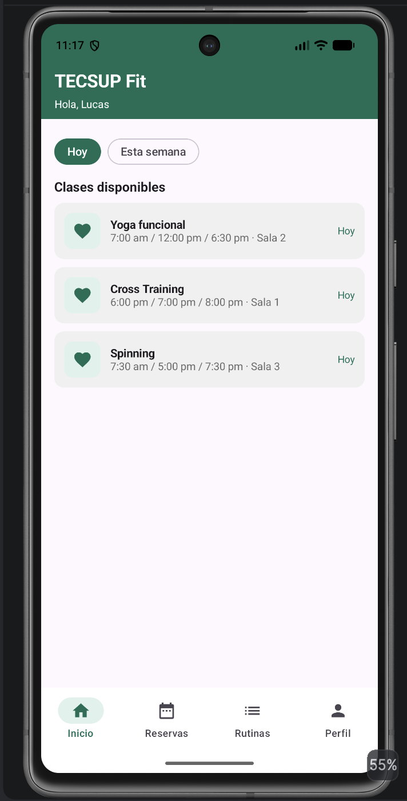
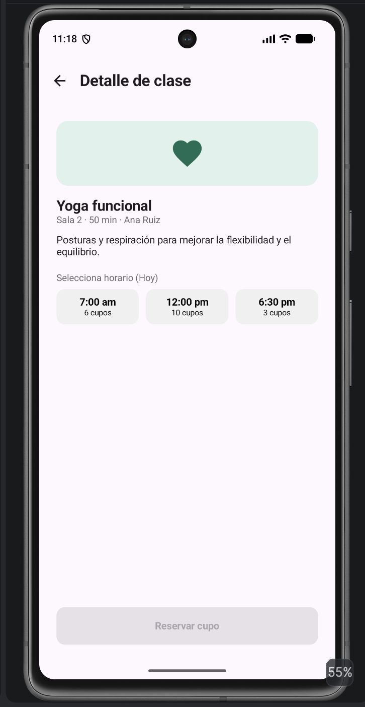
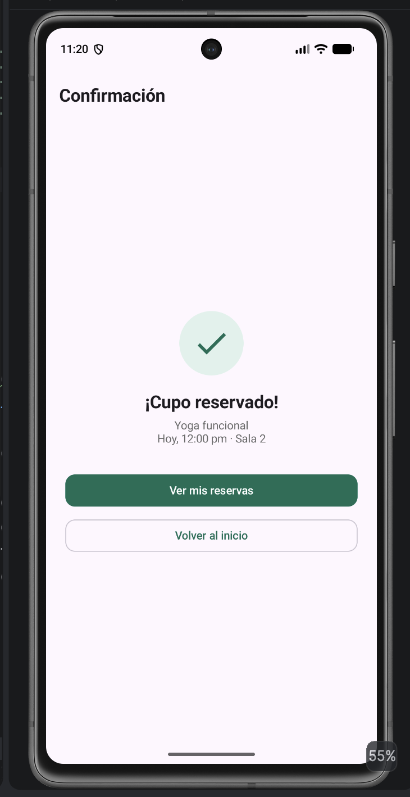
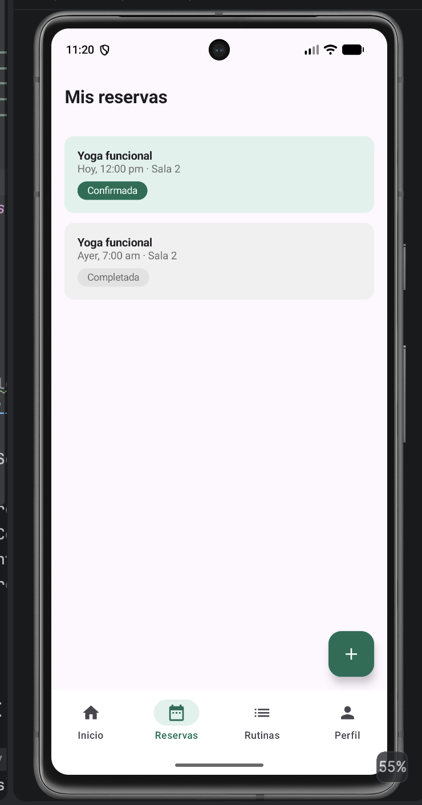
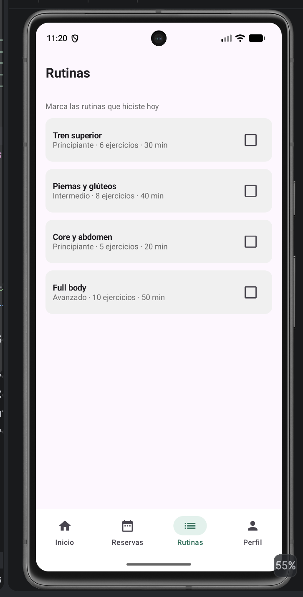
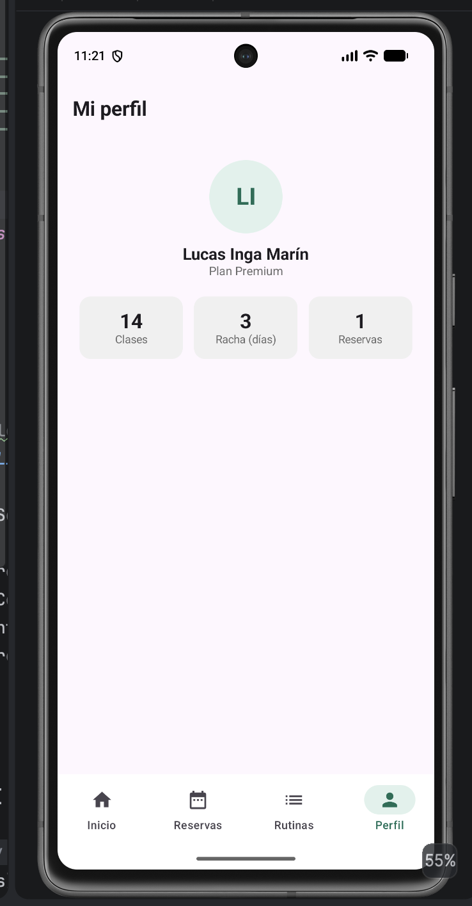
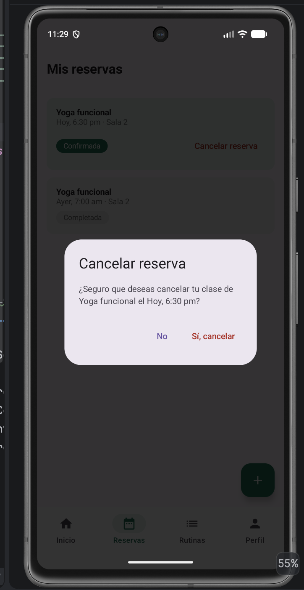
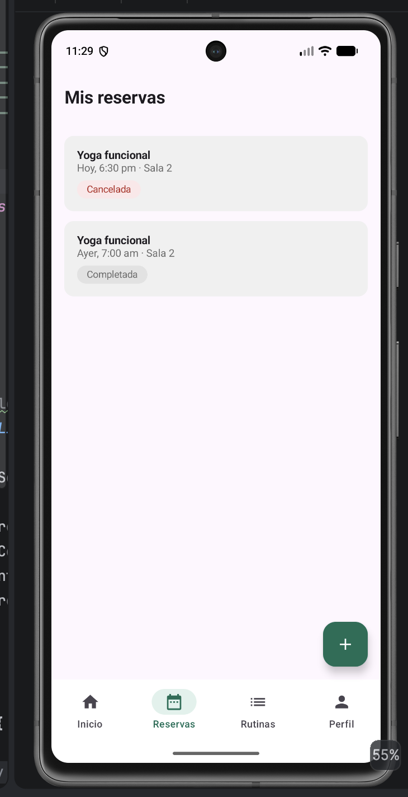

# TECSUP Fit – Opción B

**Lucas Inga Marín** · Programación en Móviles · Tarea integradora Semanas 1 a 6

App Android en Jetpack Compose para reservar clases de gimnasio. Integra layouts y controles, listas con `LazyColumn` y `LazyRow`, navegación secuencial con paso de parámetros y navegación secundaria con un `bottomBar` de Scaffold. No usa ViewModel ni MVVM: el estado se maneja con `remember` y `mutableStateOf`.

## Ramas

| Rama | Contenido |
|---|---|
| `main` | Fase 1: app completa según el enunciado |
| `mejora-ia-fit` | Fase 2: cancelación de reservas con IA + `PROMPTS.md` |

## Requerimientos funcionales

| Código | Requerimiento |
|---|---|
| RF-01 | El Inicio muestra chips de filtro "Hoy" y "Esta semana" (`LazyRow`) y la lista de clases (`LazyColumn`) con nombre, horarios y sala. |
| RF-02 | El filtro "Hoy" muestra solo las clases del día; "Esta semana" muestra todas. |
| RF-03 | El detalle de clase recibe el id de la clase por parámetro de navegación y muestra sala, duración, instructor y descripción. |
| RF-04 | El usuario elige un horario (selección única) y ve los cupos disponibles; "Reservar cupo" solo se activa con un horario elegido. |
| RF-05 | La confirmación muestra el resumen de la reserva (clase, día, hora y sala) con el botón "Ver mis reservas". |
| RF-06 | El `bottomBar` con 4 pestañas (Inicio, Reservas, Rutinas, Perfil) resalta la pestaña de la pantalla actual. |
| RF-07 | Mis reservas lista las reservas con su estado (Confirmada / Completada) diferenciado por color, e incluye un FAB para reservar otra clase. |
| RF-08 | Rutinas lista rutinas de entrenamiento que se pueden marcar como hechas con un Checkbox. |
| RF-09 | El Perfil muestra los datos del usuario y sus estadísticas: clases tomadas, racha y reservas activas. |
| RF-10 *(rama IA)* | Las reservas Confirmadas se pueden cancelar con un AlertDialog de confirmación y pasan al estado "Cancelada". |

## Flujo de navegación

```
Inicio ──(claseId)──► Detalle de clase ──(claseId, horarioIndex)──► Confirmación

bottomBar: Inicio · Reservas · Rutinas · Perfil
```

## Estructura del proyecto

```
com.lucasinga.semana05_tecsupfit
├── model        → Modelos.kt (data class) y Datos.kt (datos de ejemplo)
├── navigation   → Screen.kt, BarraInferior.kt (bottomBar) y AppNavigation.kt (NavHost)
├── screens      → Inicio, DetalleClase, Confirmacion, Reservas, Rutinas, Perfil
├── ui.theme     → colores verdes del gimnasio
└── MainActivity.kt → solo llama a AppNavigation()
```

## Conceptos aplicados

- **Scaffold** con `topBar`, `bottomBar`, `floatingActionButton` y `content { padding -> }`.
- **bottomBar:** usa `currentBackStackEntryAsState()` para saber la ruta actual y resaltar la pestaña activa.
- **NavHost / navArgument** con argumentos `Int`; **popUpTo** al reservar, para no volver a reservar con "atrás".
- **Listas anidadas:** la `LazyRow` de filtros va dentro de la `LazyColumn` de clases.
- **Selección única** de horario (como RadioButton) y **Checkbox** de selección múltiple en Rutinas.

## Mejora con IA (rama `mejora-ia-fit`)

Con el agente de **Gemini 3.6 Flash** en Android Studio se agregó la **cancelación de reservas con AlertDialog**. El prompt y lo que se revisó están en [`PROMPTS.md`](PROMPTS.md).

## Capturas

<p>
  
  
  
  
</p>
<p>
  
  
  
  
</p>